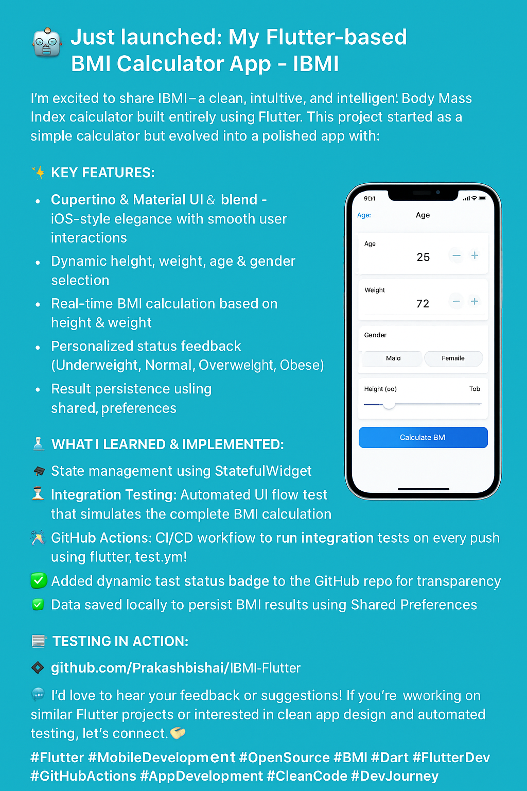
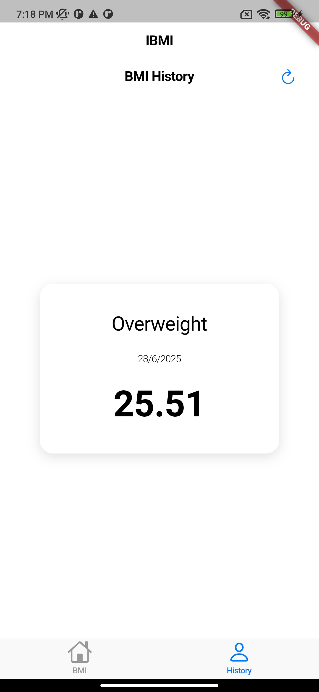
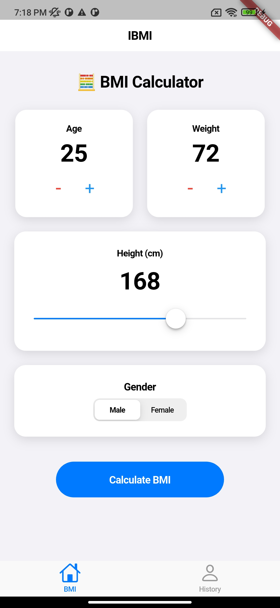

# IBMI - BMI Calculator App

A BMI Calculator built with Flutter. This app allows users to input their age, height, weight, and gender, and calculates their Body Mass Index (BMI) with interpretation. It includes:

- 🎯 Clean, iOS-style UI using `Cupertino` widgets
- 📊 Real-time height adjustment via slider
- 🧠 BMI calculation logic with feedback (Underweight, Normal, Overweight, etc.)
- 💾 Persistent storage using `shared_preferences`
- 🧪 Full integration testing using `integration_test`
- 🚀 CI via GitHub Actions (`flutter_test.yml`)

## 🛠️ Tech Stack

- **Flutter** (Cupertino widgets)
- **Dart**
- **Shared Preferences** (for local data storage)

---

